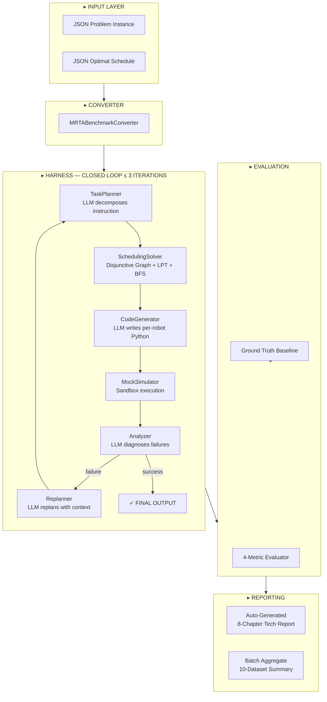
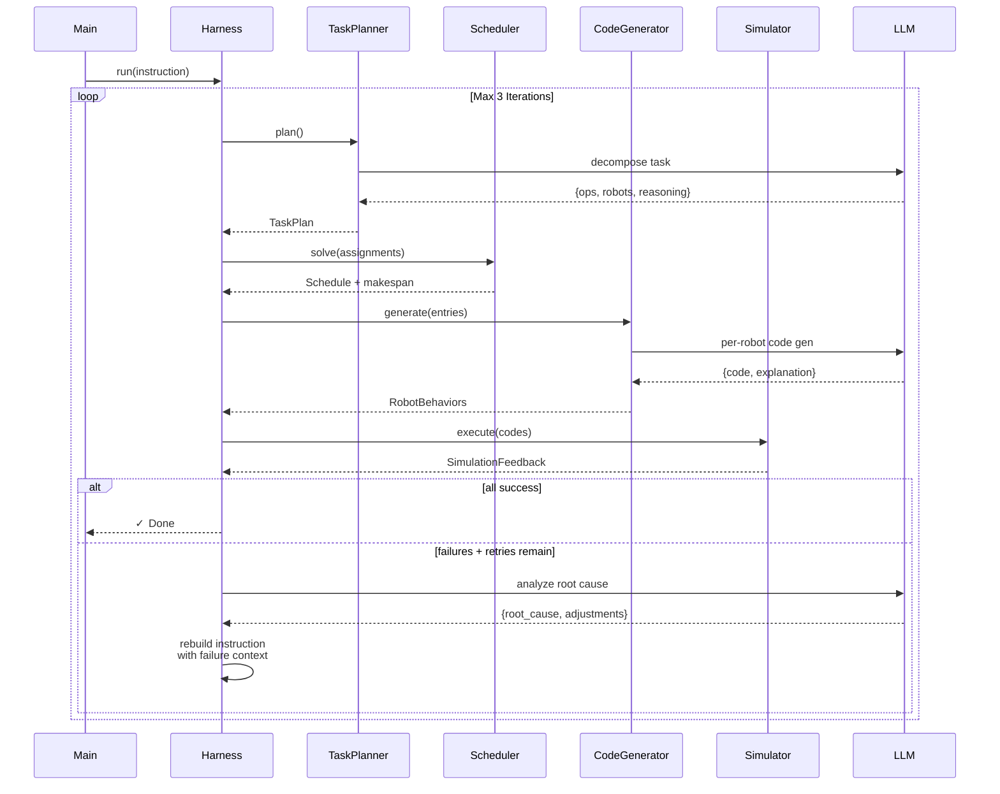

<div align="center">

# Multi‑Robot Scheduler with LLM


<br>

```
╔══════════════════════════════════════════════════════════════════════════════╗
║                                                                            ║
║   ██╗  ██╗ █████╗ ██████╗ ███╗   ██╗███████╗███████╗███████╗              ║
║   ██║  ██║██╔══██╗██╔══██╗████╗  ██║██╔════╝██╔════╝██╔════╝              ║
║   ███████║███████║██████╔╝██╔██╗ ██║█████╗  ███████╗███████╗              ║
║   ██╔══██║██╔══██║██╔══██╗██║╚██╗██║██╔══╝  ╚════██║╚════██║              ║
║   ██║  ██║██║  ██║██║  ██║██║ ╚████║███████╗███████║███████║              ║
║   ╚═╝  ╚═╝╚═╝  ╚═╝╚═╝  ╚═╝╚═╝  ╚═══╝╚══════╝╚══════╝╚══════╝              ║
║                                                                            ║
║      LLM-Driven Multi-Robot Scheduling Agent · Closed-Loop Harness         ║
║                                                                            ║
╚══════════════════════════════════════════════════════════════════════════════╝
```

**LLM → TaskPlan → Disjunctive Graph → CodeGen → Sandbox → Feedback → Replan**

</div>

---

```
OVERVIEW
```

Harness is a **closed-loop multi-robot scheduling framework** where an LLM-powered agent decomposes natural language instructions, generates per-robot behavior code, executes it in a sandbox simulator, and automatically replans on failure — zero human intervention.


```
                    ┌──────────┐     ┌──────────┐
                    │  LLM     │     │  Algo    │
                    │  Plans   │────▶│  Solves  │
                    └──────────┘     └──────────┘
                         ▲                │
                         │                ▼
                    ┌──────────┐     ┌──────────┐
                    │  Harness │     │  LLM     │
                    │  Replans │◀────│  Writes  │
                    └──────────┘     │  Code    │
                                     └──────────┘
                                          │
                         ┌────────────────┘
                         ▼
                    ┌──────────┐     ┌──────────┐
                    │  Sandbox │────▶│  4-Metric│
                    │  Execs   │     │  Eval    │
                    └──────────┘     └──────────┘
```

---

```
ARCHITECTURE
```



---

```
HARNESS LOOP
```



---

```
PERFORMANCE DASHBOARD
```

<div align="center">

| | | | |
|:--:|:--:|:--:|:--:|
|  |  |  |  |

</div>

| Metric | Value | Δ vs Baseline |
|--------|-------|---------------|
| **Makespan Δ%** (mean) | `+18.7%` | σ = 13.3% |
| **Best Case** (#000003) | `Δ = 0.0%` | Perfect Match |
| **Worst Case** (#000006) | `Δ = +36.8%` | Collaborative sync gap |
| **Perfect Scores** | 3 / 10 | #000000, #000002, #000003 |
| **Harness Corrections** | 1 / 10 | #000009: `hasattr()` auto-fixed |

```
SCORE DISTRIBUTION                  MAKESPAN DELTA DISTRIBUTION

  100 ██████████ 3                    0-5%  ██████████ 3
80-99 ██████ 2                       5-15%  ░░░░░░░░░░ 0
60-79 ██████████████ 5              15-25%  ██████████ 3
  <60 ░░░░░░░░░░ 0                  25-35%  ██████████ 3
                                      >35%  ██████ 1
```

---

```
DATASET LEADERBOARD
```

| # | Δ% | Score | Rating |
|--|-----|-------|--------|
| `000003` | **0.0%** | 100 | `████████████████████` ★ PERFECT |
| `000000` | +4.2% | 100 | `████████████████████` |
| `000002` | +2.7% | 100 | `████████████████████` |
| `000008` | +16.8% | 86 | `█████████████████░░░` |
| `000005` | +16.1% | 80 | `████████████████░░░░` |
| `000001` | +29.8% | 74 | `███████████████░░░░░` |
| `000007` | +26.2% | 74 | `███████████████░░░░░` |
| `000009` | +20.2% | 74 | `███████████████░░░░░` ⟳ 2 iters |
| `000004` | +34.4% | 65 | `█████████████░░░░░░░` |
| `000006` | +36.8% | 65 | `█████████████░░░░░░░` ⚠ worst |

---

```
GANTT — PERFECT MATCH · 000003
```

The only dataset where our solver **exactly reproduced** the ground-truth timeline.

```
╔══════════════════════════════════════════════════════════════╗
║   OPTIMAL (MRTA-Benchmark)     vs      SYSTEM (Harness)     ║
╠════════════════════════════════╤═════════════════════════════╣
║  0    79   159   238   317 396 │ 0    79   159   238   317 396║
╟────────────────────────────────┼─────────────────────────────╢
║  ··████3███····████5█████····▌│ ··████3███····████5█████····▌║ arm_0
║  ······██████1███████2████·██▌│ ······██████2███████1████·██▌║ arm_1
║  ··████7███····████4████·███▌│ ··████7███····████4████·███▌║ arm_2
╚════════════════════════════════╧═════════════════════════════╝
  GT 396.9s  →  SYS 396.9s  (Δ = 0.0%)
```

---

```
GANTT — HARNESS LOOP DEMO · 000009
```

The only dataset requiring **2 Harness iterations**. Iteration #1 failed: `hasattr()` not allowed in sandbox → LLM self-corrected → iteration #2 succeeded.

```
╔══════════════════════════════════════════════════════════════════════╗
║   OPTIMAL (MRTA-Benchmark)       vs        SYSTEM (Harness #2)      ║
╠══════════════════════════════════╤═══════════════════════════════════╣
║  0   140   281   422   563   704 │ 0   169   338   508   677    846 ║
╟──────────────────────────────────┼───────────────────────────────────╢
║  ··██4██···█7█·█2█··████5███·1█▌│ ·█7█··████4███···███5███·1█·3·2█▌║ arm_0
║  ···························1█▌│ ·······················1█········▌║ arm_1
║  ··██6███···█8█···············▌│ ··██6███···█8█··················▌║ arm_2
╚══════════════════════════════════╧═══════════════════════════════════╝
  GT 704.4s  →  SYS 846.8s  (Δ = +20.2%)  ·  Score: 74/100
```

<details>
<summary><b>⟳ Click to expand: Harness Correction Trace</b></summary>

```
ITERATION #1 ────────────────────────── ❌ FAILED
│
├─ TaskPlanner: assign arm_0 → [op_7,op_4,op_5,op_1,op_3,op_2]
├─ Scheduler:   makespan plan = 432s
├─ CodeGen:     arm_0 code uses hasattr(robot_state, 'last_time')
├─ Simulator:   NameError → all 6 arm_0 ops fail
└─ Analyzer:    root_cause = "hasattr() banned in sandbox"
                adjustments = ["use is not None instead"]

ITERATION #2 ────────────────────────── ✓ SUCCESS
│
├─ Replanner:   instruction += failure context + LLM fix suggestions
├─ TaskPlanner: same assignment (schedule was never the problem)
├─ CodeGen:     robot_state.last_time if robot_state.last_time is not None else 0.0
├─ Simulator:   25/25 primitives executed
└─ Score:        74/100
```
</details>

---

```
MODULE INVENTORY
```

| Module | File | Role | LLM |
|--------|------|------|:---:|
| **Converter** | `mrta_converter.py` | MRTA-Benchmark JSON → internal Scene | — |
| **TaskPlanner** | `task_planner.py` | NL instruction → op-robot assignment | ✓ |
| **Scheduler** | `scheduler.py` | Disjunctive Graph + LPT + BFS cycle detect | — |
| **CodeGenerator** | `code_generator.py` | Schedule → per-robot Python behavior code | ✓ |
| **CodeExecutor** | `code_executor.py` | Sandbox with 5 atomic primitives + FlexState | — |
| **Simulator** | `simulator.py` | Time-step sync engine, collision detection | — |
| **Harness** | `harness.py` | Closed-loop: plan → exec → analyze → replan | — |
| **Evaluator** | `evaluator.py` | 4 metrics + Gantt chart vs ground truth | — |
| **LLM Interface** | `llm_interface.py` | OpenAI / DeepSeek / Mock factory | ✓ |
| **ReportGen** | `gen_report.py` | 8-chapter Markdown from session JSON | — |
| **AggregateReporter** | `aggregate_reporter.py` | Cross-dataset summary tables | — |

---

```
QUICK START
```

```bash
# 1 · Environment
conda env create -f environment.yml
conda activate harness_env

# 2 · Single dataset (Mock — no LLM API calls)
python main.py --mock

# 3 · Single dataset (Live LLM — DeepSeek)
python main.py

# 4 · Batch all 10 datasets
python run_batch.py all --mock

# 5 · Regenerate report from session
python src/gen_report.py --session output/session_1p_000003_20250623_001326.json
```

```
OUTPUT per dataset:
  output/
  ├── session_{tag}_{ts}.json           ← Master record (all data in one file)
  ├── tech_report_{tag}_{ts}.md         ← 8-chapter auto-generated report
  ├── final_schedule_{tag}_{ts}.json    ← Schedule entries + makespan
  ├── harness_report_{tag}_{ts}.json    ← Iteration history + LLM reasoning
  └── evaluation_report_{tag}_{ts}.json ← 4 metrics vs ground truth

AFTER batch:
  output/
  └── batch_summary_{ts}.md             ← Cross-dataset aggregation
```

---

```
TECH REPORT STRUCTURE
```

Each run auto-generates an 8-chapter Markdown report via `gen_report.py`:

```
1. Scene Overview       → Robots · Operations · Transport matrix
2. Execution Flow       → Per-iteration plan → exec → verdict
3. LLM Reasoning Chain  → TaskPlan reasoning · CodeGen explanation · Failure analysis (raw)
4. Generated Code       → Per-robot Python behavior code
5. Gantt Chart          → Optimal vs System side-by-side (ASCII)
6. Performance Metrics  → Makespan · Success rate · Utilization · Violations · Score
7. Failure Analysis     → Root cause + adjustments (if any)
8. Summary              → Key findings + improvement directions
```

---

```
SCORING FORMULA
```

```
Score = 100 − max(0, Δmakespan% × 2) − (1 − SR) × 50 − V × 5

  Δmakespan%   = (sys_makespan − gt_makespan) / gt_makespan × 100
  SR           = success_rate (0.0 ~ 1.0)
  V            = number of constraint violations
  Utilization  = Σ(duration) / (makespan × n_robots)   [reference only]
```

---


```
PROJECT STATUS
```

| Dimension | Completion | Detail |
|-----------|:----------:|--------|
| Harness Closed-Loop | **100%** | Plan → Exec → Analyze → Replan (verified on #000009) |
| LLM-Driven Agent | **100%** | 3 LLM call points: TaskPlanner, CodeGenerator, Analyzer |
| Atomic Primitives | **100%** | 5 primitives, dynamic composition, no fixed skill library |
| Dataset & Evaluation | **100%** | MRTA-Benchmark × 10 scenes, 4 metrics, scoring formula |
| Auto-Report System | **100%** | Session JSON → 8-chapter Markdown → batch aggregate |
| Isaac Lab Visualization | **0%** | Attempted; blocked by GPU (8GB), asset gaps, learning curve |

```
                    ┌─────────────────────────────────────────┐
                    │  CORE FRAMEWORK ··············· 100% ██ │
                    │  LLM AGENT ···················· 100% ██ │
                    │  EVALUATION ··················· 100% ██ │
                    │  DOCUMENTATION ················ 100% ██ │
                    │  SIM VISUALIZATION ·············· 0% ░░ │
                    └─────────────────────────────────────────┘
```

---


```
LESSONS LEARNED
```

- **Prompt engineering is the bottleneck.** 6 iterations to stabilize LLM code generation. Critical: explicit field lists, time-window enforcement, location injection, failure context.
- **Hybrid LLM + Algorithm is the right split.** Disjunctive Graph solver is deterministic, fast, and provably cycle-free. LLM handles semantics, code, and error diagnosis — not math.
- **`FlexState` is a double-edged sword.** Dual access mode solved LLM compatibility but auto-nesting caused silent comparison bugs. Return `None`, not auto-objects.
- **Time sync must be atomic.** `robot_state.last_time` touches all code paths. The fix: update it in every primitive, every time, automatically.
- **Batch evaluation catches what unit tests miss.** The fake 100/100 score was only visible in cross-dataset comparison.
- **Isaac Lab is an overkill for scheduling validation.** For algorithm-centric projects, mock simulation + Gantt charts provide faster, clearer feedback than 3D rendering.

---


<div align="center">

```
╔══════════════════════════════════════════════════════════════╗
║                                                            ║
║   ██████╗ ███████╗██████╗  ██████╗ ███████╗               ║
║   ██╔══██╗██╔════╝██╔══██╗██╔═══██╗██╔════╝               ║
║   ██████╔╝█████╗  ██████╔╝██║   ██║███████╗               ║
║   ██╔══██╗██╔══╝  ██╔═══╝ ██║   ██║╚════██║               ║
║   ██║  ██║███████╗██║     ╚██████╔╝███████║               ║
║   ╚═╝  ╚═╝╚══════╝╚═╝      ╚═════╝ ╚══════╝               ║
║                                                            ║
║   docs/Harness设计文档.md · docs/仿真测试报告及评估对比.md    ║
║   docs/technical_report.tex · docs/汇报总结.md               ║
║                                                            ║
╚══════════════════════════════════════════════════════════════╝
```


</div>
