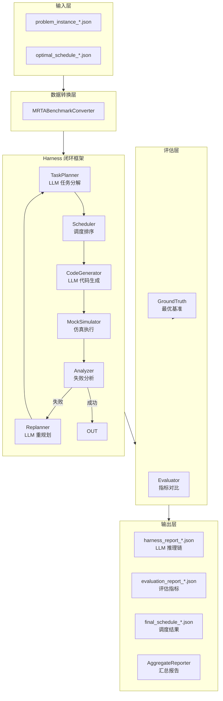
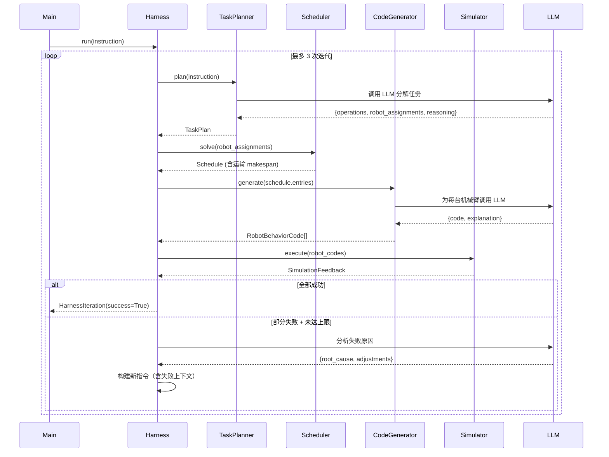

# Harness 闭环调度框架 — 设计文档

> **版本**: v8.0  
> **日期**: 2025-06-22
> **适用场景**: 多机器人任务规划与调度

## 一、概述

### 1 设计目标

Harness 是一个**闭环（closed-loop）多机器人调度框架**，核心思路是：

```
规划 → 执行 → 反馈 → 分析 → (失败时) 重规划
  ↑                                    │
  └────────────────────────────────────┘
```

与开环调度不同，Harness 将仿真执行结果作为反馈信号回传给规划器，使系统能够根据实际执行情况动态调整策略。

### 2 核心特性

| 特性 | 说明 |
|---|---|
| **LLM 驱动规划** | 使用大语言模型（DeepSeek / OpenAI）进行任务分解和代码生成 |
| **闭环反馈** | 执行失败时自动触发 LLM 分析和重规划 |
| **运输感知** | makespan 计算包含 depot 出发和返回的全路径运输时间 |
| **MRTA-Benchmark 对齐** | 评估口径与学术基准严格一致 |
| **批量评估** | 支持一键运行 10 个数据集并汇总统计 |

---

## 二、架构总览



## 三、数据模型

### 1 场景建模

```
Scene
├── CellLayout
│   ├── Location[]      # loc_0 (起始仓库) ~ loc_N (结束仓库)
│   └── TransportEdge[] # 位置间运输距离（全连通图）
├── Resources
│   ├── Robot[]          # arm_0 ~ arm_N, 初始位置 loc_0
│   └── Tool[]           # gripper + tool_0 ~ tool_N
├── Operation[]          # op_1 ~ op_N, 含前置依赖
├── Workpiece[]          # wp_0 ~ wp_N, 含工艺流程
└── Station[]            # 工位
```

### 2 调度模型

```python
Schedule
├── entries: List[ScheduleEntry]
│   ├── operation_id    # 如 "op_1"
│   ├── robot_id        # 如 "arm_0"
│   ├── start_time      # 执行开始（不含运输）
│   ├── end_time        # 执行结束（不含运输）
│   └── resources       # 使用资源
├── makespan: float     # 总完成时间（含运输+返程）
└── transport_time: float  # 累计运输耗时
```

### 3 闭环迭代模型

```
HarnessIteration
├── task_plan: TaskPlan       # LLM 任务分解结果（含 reasoning）
├── schedule: Schedule        # 调度器输出
├── generated_codes: Dict     # LLM 生成的行为代码
│   └── arm_X → RobotBehaviorCode {code, explanation}
├── feedback: SimulationFeedback  # 仿真结果
└── failure_reason: str       # 失败分析
```

---

## 四、核心流程

### 1 Harness 主循环



### 2 径流对比

| 阶段 | 输入 | LLM 调用 | 输出 |
|---|---|---|---|
| **任务分解** | 自然语言指令 + Scene | 1 次 | TaskPlan（操作列表+机械臂分配+推理过程） |
| **调度排序** | TaskPlan | 无 | Schedule（含运输时间） |
| **代码生成** | Schedule（按机械臂分组） | N 次（每台机械臂 1 次） | RobotBehaviorCode[] |
| **仿真执行** | RobotBehaviorCode[] | 无 | SimulationFeedback |
| **失败分析** | FailureInfo + 轨迹 | 1 次 | {root_cause, adjustments} |
| **重规划** | 原指令 + 失败上下文 | 无（合并到下一轮任务分解） | 新 instruction |

### 3 失败重规划策略

```
执行失败
  ├── 资源冲突 → LLM 分析冲突原因 → 错开操作时间
  ├── 超时 → LLM 分析是否可拆分 → 调整时间预算
  ├── 代码错误 → LLM 修正代码逻辑
  └── 所有操作失败 → 标记最终失败，输出最后迭代结果
```

---

## 五、关键模块详解

### 5.1 TaskPlanner（任务分解器）

**职责**：将自然语言产线描述分解为结构化操作-机器人分配方案。

**输入**：自然语言指令 + Scene 场景对象

**输出**：`TaskPlan { operations, robot_assignments, reasoning }`

**容错机制**：
- `op1` → `op_1` 自动修正（补下划线）
- 字符串 `"arm_0"` → 数组 `["arm_0"]` 自动修正
- 无效操作 ID 回退到默认均衡分配计划

#### Prompt 定义

**系统提示词** (`_build_system_prompt()`)：

```
你是一个多机械臂生产线调度专家。
你的任务是根据用户指令分解任务，并生成结构化的任务计划。

任务计划需要包含：
1. 操作序列：按照生产工艺顺序列出所有需要执行的操作
2. 机械臂分配：为每个操作分配合适的机械臂

输出必须是有效的 JSON 格式。
```

**用户提示词模板** (`_build_planning_prompt()`)：

```
场景信息：
{scene_desc}          ← 由 _describe_scene() 动态生成：产线名称、描述、工件列表、
                        机械臂能力、操作详情（ID/类型/工件/耗时/允许机器人/前置依赖）

用户指令：
{instruction}         ← 来自用户输入或重规划阶段拼接的指令

请根据上述场景和指令，生成一个任务计划。返回严格的 JSON 格式，包含以下字段：
{
    "operations": ["op_1", "op_2", ...],
    "robot_assignments": {
        "op_1": ["arm_0"],
        "op_2": ["arm_1", "arm_2"],
        ...
    },
    "reasoning": "分解过程的详细说明"
}

【严格要求】
1. operations 中的操作 ID 必须与场景中列出的完全一致（含下划线，如 "op_1" 而非 "op1"）
2. robot_assignments 中每个操作的机械臂必须是数组格式，即使只有一台机械臂也要写成 ["arm_0"]
3. 协作任务（allowed_robots 中有多台机械臂）需要分配所有参与机械臂，写成 ["arm_1", "arm_2"] 格式
4. 机械臂 ID 必须是 "arm_0"、"arm_1"、"arm_2" 之一
5. 遵守操作的前置依赖关系
```

---

### 5.2 Scheduler（调度器）

**职责**：基于 LLM 的机器人分配方案，用析取图算法计算最优时间线。

**输入**：`robot_assignments` 字典（操作 → 机器人列表）

**输出**：`Schedule { entries, makespan, transport_time }`

**核心算法**：析取图模型 + LPT 启发式 + 环检测，详见 [附录 A](#附录-a调度算法)。

---

### 5.3 CodeGenerator（代码生成器）

**职责**：将调度计划转换为每台机器人可执行的行为代码。

**输入**：按机器人分组的 `ScheduleEntry` 列表 + 可选的 `failure_context`（来自上轮失败分析）

**输出**：`RobotBehaviorCode[] { code, explanation }`

**沙箱限制**：
- 禁止 `import`、`hasattr()`、`next()`、`iter()`
- 禁用 `try-except`
- 只能用 5 个原子原语：`move`, `pick`, `place`, `operate`, `wait`

#### Prompt 定义

**系统提示词** (`_build_code_generation_system_prompt()`)：

```
你是一个机械臂编程专家。
你的任务是根据调度计划为机械臂生成 Python 代码。

生成的代码应该：
1. 使用提供的原子技能原语（move, pick, place, operate, wait）
2. 遵循调度表中的时间顺序
3. 在适当的位置处理错误和异常
4. 包含必要的工件状态更新

【最重要规则 - 必须严格遵守调度时间窗】
- 调度表中的 [start_time, end_time] 是硬约束，不是建议！
- **每个操作必须先 wait 到 start_time 才能开始执行**，否则会与其他机械臂发生资源冲突
- 代码模板：
  # 操作 op_X [start_time, end_time]，位置 location_Y，工件 wp_Z
  elapsed = robot_state.last_time  # 当前已耗时
  if elapsed < start_time:
      wait(start_time - elapsed)   # 对齐调度时间窗
  move(location_Y, 5.0)           # 移动到工位
  operate(op_type, wp_Z, location_Y)
  # operate 内部消耗时间，不需要额外 wait

- **时间对齐是第一优先级**：即使移动/操作更快完成，也要通过 wait 确保不会提前进入下一个操作的 start_time
- wait() 在以下情况使用：(1) 对齐 start_time (2) 操作完成后对齐 end_time
- 调度器的 [start, end] 已经解决了所有机械臂间的资源冲突，你只需要严格按时间窗执行
- 绝对不要生成只有 wait() 调用的代码——每个操作必须调用 operate/move 等非 wait 原语

【robot_state 可用字段（支持 .field 和 ['field'] 两种访问方式）】
  - robot_state.robot_id (str): 机械臂 ID
  - robot_state.current_location (str): 当前位置
  - robot_state.last_operation (str|None): 上一个执行的操作 ID
  - robot_state.last_time (float): 上一个操作的时间戳
  - robot_state.holding_workpiece (str|None): 当前持有的工件 ID

【world_state 可用字段】
  - world_state.workpieces (dict-like): 工件状态，如 world_state.workpieces['wp_0']
  - world_state.stations (dict-like): 工位状态，如 world_state.stations['loc_1']

【重要】不要访问未声明的字段（如 world_state.time 等），它们将返回 None。

【沙箱限制 - 必须严格遵守】
代码在受限沙箱中执行，以下规则必须遵守：
1. 禁止使用 import 语句（沙箱不支持任何模块导入）
2. 禁止使用 hasattr() 函数
3. 禁止使用 next()、iter() 等迭代器函数
4. 不要写 try-except 块，用简单的 if 条件判断代替
5. 可用内置函数：print, len, range, int, float, str, list, dict, bool, abs, min, max, round, sum, enumerate, zip, type, isinstance
6. 可用异常类型：Exception, ValueError, TypeError, KeyError, IndexError, AttributeError, RuntimeError, NameError, OSError, StopIteration
7. robot_state 和 world_state 的字段使用 .field 方式访问，对可能的 None 值做防御检查

输出必须是有效的 JSON 格式，包含 "code" 和 "explanation" 字段。
```

**用户提示词模板** (`_build_code_generation_prompt()`)：

```
机械臂: {robot_id} ({robot.name})
初始位置: {robot.initial_location}
能力: {robot.capabilities}
装备工具: {robot.tools}

{schedule_info}       ← 每操作的完整信息：工位、工件、start_time、end_time、耗时
{failure_section}     ← 仅在有 failure_context 时拼接：
                        【上次执行失败 - 请针对性修复】
                        {failure_context}
                        注意：上述失败的根因和调整建议必须在你生成的代码中体现！

请生成该机械臂的行为代码。代码应该使用以下原子技能原语：

def move(location: str, duration: float):
    '''移动到指定位置，耗时 duration 秒'''
def pick(workpiece_id: str):
    '''拾取指定工件'''
def place(location: str):
    '''在指定位置放下工件'''
def operate(operation_type: str, workpiece_id: str, location: str):
    '''执行操作（焊接、抛光等）'''
def wait(duration: float):
    '''等待指定时间'''

【状态对象说明】
robot_state 支持以下字段（使用 .field 或 ['field'] 均可）:
  - robot_id, current_location, last_operation, last_time, holding_workpiece
world_state 支持以下字段:
  - workpieces (嵌套字典), stations (嵌套字典)
不要访问上述未列出的字段（如 world_state.time 等）。

【沙箱限制 - 生成代码前必须检查】
1. 不要写 import 语句
2. 不要使用 hasattr()、next()、iter()
3. 不需要 try-except，沙箱内不支持 import traceback
4. 只使用上述列出的 5 个原语函数和可用内置函数

代码模板：
python
def robot_behavior(robot_state, world_state):
    '''机械臂的行为函数'''
    elapsed = robot_state.last_time

    # 操作 op_X [start_time, end_time]，工位 loc_Y
    if elapsed < start_time:
        wait(start_time - elapsed)

    move("loc_Y", 5.0)
    operate("op_type", "wp_Z", "loc_Y")

    # 下一个操作同理...
    pass

返回 JSON 格式：
{
    "code": "生成的 Python 代码",
    "explanation": "代码的详细说明"
}
```

---

### 5.4 原子原语定义

| 原语 | 作用 | 耗时 | 副作用 |
|---|---|---|---|
| `move(loc, duration)` | 移动到指定位置 | `duration` 秒 | 更新 `robot_state.loc`，推进虚拟时钟 |
| `pick(wp_id)` | 拾取工件 | 0 秒 | 检查工件存在性，标记持有 |
| `place(loc)` | 放置工件 | 0 秒 | 释放工件到指定位置 |
| `operate(type, wp_id, loc)` | 执行加工操作 | `operation.duration` 秒 | 检查工位冲突（协作工件豁免），推进时钟 |
| `wait(duration)` | 空闲等待 | `duration` 秒 | 仅推进虚拟时钟 |

---

### 5.5 CodeExecutor（代码执行器）与 Simulator（仿真器）

**CodeExecutor 职责**：为单台机器人创建 Python 沙箱，拦截 5 个原子原语，管理共享世界状态。

**关键机制**：
- **共享 `world_state`**：工件位置、工位占用状态（`occupied_until` 时间戳）
- **独立 `robot_state`**：当前位置、虚拟时钟、`last_time`
- **虚拟时钟独立**：每台机器人从 0 开始，不受真实时间影响
- **`robot_state.last_time` 自动同步**：5 个原语执行后均更新 `last_time = virtual_clock[0]`，确保 LLM 的时间窗对齐逻辑正确运作
- **工位冲突检测**：`operate()` 执行前检查工位 `occupied_until` 是否冲突
- **协作任务免冲突**：同一 `operation_id` 被多机器人执行时，冲突检测自动放行

**MockSimulator 执行流程**：
1. 从 `schedule.entries` 识别协作工件（`op_robot_count[op_id] > 1`）
2. 为每台机器人构建独立 `CodeExecutor`，传入 `collaborative_workpieces` 集合
3. 顺序执行各机器人代码 → 收集 `RobotExecutionTrace`
4. 失败不静默回退，由 Harness 检测并触发重规划

---

### 5.6 Harness 失败分析（Analyzer）

**职责**：当仿真执行失败时，调用 LLM 分析根因并生成调整建议。

**输入**：原始指令 + 失败信息 + 机器人执行轨迹 + 迭代次数

**输出**：`{ root_cause, adjustments }`

#### Prompt 定义

**系统提示词** (`_build_failure_analysis_system_prompt()`)：

```
你是一个多机械臂调度系统的故障分析专家。
你的任务是分析执行失败的根本原因，并给出可操作的调整建议。

分析时请关注：
1. 失败的模式（是资源冲突、超时还是代码逻辑错误？）
2. 是否同一资源被多次抢占
3. 协作任务中是否有机器人未能同步
4. 操作顺序是否可以优化

返回 JSON 格式：
{
    "root_cause": "失败的根本原因分析（中文，1-2句话）",
    "adjustments": ["调整建议1", "调整建议2", "调整建议3"]
}
```

**用户提示词模板** (`_build_failure_analysis_prompt()`)：

```
原始任务: {original_instruction}

执行失败信息:
{failure_info}

机械臂执行轨迹:
{trace_summary}

这是第 {iteration_num} 次迭代失败。
请分析失败的根本原因，并给出具体的调整建议。
```

**重规划指令拼接** (`_replanning_phase()`) — 将 LLM 分析结果拼入下一轮 TaskPlanner 的指令：

```
原始指令: {original_instruction}

上次执行的失败信息:
{failure_info}

执行轨迹摘要:
{trace_summary}

LLM 分析根因: {root_cause}
LLM 建议的调整策略:
  1. {adjustment_1}
  2. {adjustment_2}
  3. {adjustment_3}

请根据上述失败分析重新规划任务。调整建议:
1. 如果是资源冲突：考虑错开使用相同资源的操作，或调整机械臂分配
2. 如果是超时：考虑将该操作拆分为更小的步骤，或延长时间预算
3. 如果是代码执行错误：检查代码逻辑，确保原语调用顺序正确

请生成改进的任务计划，包括更合理的机械臂分配和操作排序。
```

---

### 5.7 Evaluator（评估器）

**对比维度**：

| 指标 | 方向 | 计算方式 |
|---|---|---|
| makespan | ↓ 越低越好 | 调度器 makespan（含运输+返程） |
| 任务成功率 | ↑ 越高越好 | 成功操作数 / 总操作数 |
| 资源利用率 | ↑ 越高越好 | Σ(机械臂活跃时间) / (makespan × N) |
| 约束违反 | ↓ 越低越好 | 资源冲突次数 |

**评分公式**：

$$Score = 100 - \max(0, \Delta_{makespan}\% \times 2) - (1 - SR) \times 50 - V \times 5$$

其中 $\Delta_{makespan}\% = \frac{makespan_{sys} - makespan_{gt}}{makespan_{gt}} \times 100$，$SR$ 为成功率，$V$ 为违规次数。

---

## 六、评估体系

### 6.1 甘特图

并排显示最优调度 vs 系统调度：


```

╔═════════════════════════════════════════════════════════════════════════════════════════════════════════════════════════════════════════════════╗
║                        最优调度 (MRTA-Benchmark)                         │                                系统生成调度                                ║
╠═══════════════════════════════════════════════════════════════════════╤════════════════════════════════════════════════════════════════════════╣
║ 0     57     114    171    228    285    342    399    456    513  570 │ 0     59     118    178    237    297    356    415    475    534  594 ║
╟───────────────────────────────────────────────────────────────────────┼────────────────────────────────────────────────────────────────────────╢
║ ··█████6██████······██████2██████····█████1██████·······█████4██████·▌ │ ··█████6█████····█████1██████····█████2██████············█████4█████·▌ ║  arm_0
╟───────────────────────────────────────────────────────────────────────┼────────────────────────────────────────────────────────────────────────╢
║ ··████8████··███7████·····████3████··································▌ │ ··███7████··███8████·······████3████·································▌ ║  arm_1
╟───────────────────────────────────────────────────────────────────────┼────────────────────────────────────────────────────────────────────────╢
║ ··████8████·········██████2██████····████5█████······················▌ │ ············███8████·············█████2██████····████5█████··········▌ ║  arm_2
╚═══════════════════════════════════════════════════════════════════════╧════════════════════════════════════════════════════════════════════════╝

  图例: █ = 操作执行  · = 空闲/运输  ▌ = makespan 终点  数字 = 操作编号
  最优 makespan = 570.2s   系统 makespan = 594.0s

```


### 6.2 汇总报告

批量运行后自动生成：

- **终端输出**：逐数据集表格 + 均值/标准差/星级
- **Markdown**：`output/batch_summary_*.md`
- **JSON**：`output/batch_summary_*.json`

### 6.3 LLM 推理链提取

工具：`extract_llm_reasoning.py`

从 `harness_report_*.json` 中提取：
- 任务分解的 reasoning
- 每个机械臂的代码生成 explanation
- 失败分析的 root_cause + adjustments

输出 Markdown + JSON，可直接粘贴到技术报告。

---

## 七、扩展指南

### 7.1 接入真实仿真器

替换 `MockSimulator`：实现 `Simulator` 抽象类，保持 `execute()` 接口不变。

### 7.2 添加新的评估指标

在 `src/evaluator.py` 的 `evaluate()` 方法中添加 `MetricComparison`，并在 `AggregateReporter` 中增加对应列。

### 7.3 增加原语

在 `src/code_executor.py` 的 `_execute_primitive()` 中添加新原语处理分支，同时在 `CodeGenerator` 的 system prompt 中声明。

## 附录 A：调度算法

### B.1 析取图模型

将调度问题建模为析取图 $G = (V, C \cup D)$：

- **节点 V**：所有操作 + source + sink
- **合取边 C**：前置依赖（必须满足的时序约束）
- **析取边 D**：资源冲突（同一机械臂的操作需排序）

### B.2 关键路径与运输时间

调度器在计算 makespan 时考虑**全链路运输**：

```
depot(loc_0) → op_1 位置 → op_2 位置 → ... → op_N 位置 → depot(loc_N)
   ↑                                                       ↑
 出发运输                                                  返程运输
```

**双向运输查找**：从 `scene.cell_layout.transport_edges` 建查找表，包含所有位置对的距离。

**协作任务同步**：多机械臂协作任务以最后一个到达的机械臂时刻为同步起点。

### B.3 启发式规则

| 规则 | 说明 |
|---|---|
| 运输优先级 | 比较两种路径方案的旅行商成本，选成本低的 |
| LPT 回退 | 运输成本相同时，按操作时长降序（Longest Processing Time first） |
| 环检测 | 加入析取边后检测环，防止死锁 |

---

## 附录 B：数据流全貌

```
problem_instance_1p_000000.json ──┐
                                  ├──→ MRTABenchmarkConverter
optimal_schedule_1p_000000.json ──┘         │
                                    ┌───────┴───────┐
                                    │  config/       │
                                    │  scene.json    │
                                    │  ground_truth  │
                                    │  .json         │
                                    └───────┬───────┘
                                            │
                                    ┌───────▼───────┐
                                    │    Harness     │
                                    │  (闭环框架)     │
                                    └───────┬───────┘
                                            │
                          ┌─────────────────┼─────────────────┐
                          ▼                 ▼                  ▼
                   harness_report   evaluation_report   final_schedule
                   _*.json          _*.json             _*.json
                          │                 │
                          │     ┌───────────┘
                          ▼     ▼
                    extract_llm    AggregateReporter
                    _reasoning.py      │
                          │            ▼
                          ▼     batch_summary_*.md
                    llm_reasoning  batch_summary_*.json
                    _report_*.md
```

## 附录 C：关键设计决策

| 决策 | 原因 |
|---|---|
| makespan 含运输+返程 | 与 MRTA-Benchmark 同口径，公平对比 |
| 调度器 + 代码生成器分离 | 调度器做全局优化（图论），代码生成器做局部实现（LLM），各司其职 |
| 甘特图用 schedule.entries 而非执行原语 | 原语 ID（arm_0_primitive_1）不可读，schedule 的操作 ID（op_1）对用户有意义 |
| 不标"随机噪声"标签 | 资源冲突是真实调度问题，标记为噪声会误导重规划 |
| 不拦截 LLM 代码 | LLM 生成代码格式多样，不应因格式不符合预期就丢弃 |
| Harness 报告含 generated_codes | 保留 LLM 的代码生成解释，方便论文分析 |
